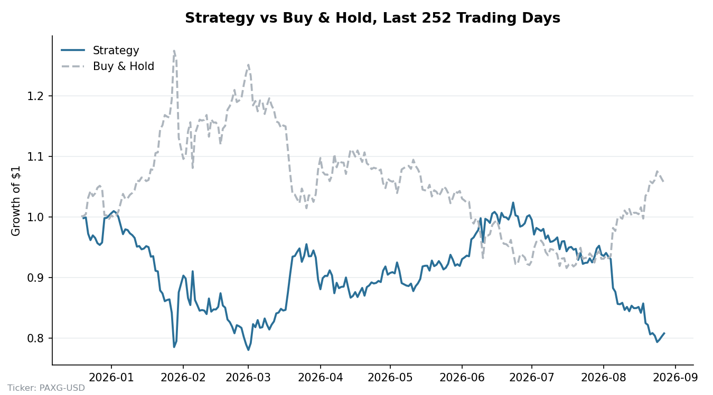

# stock-prexp

A simple pipeline to predict next day returns for PAXG using a Random Forest model.

## Files

- `config.py`: sets the data directory, CoinGecko coin id, and Alpha Vantage symbol.
- `dataclass.py`: downloads price history (CoinGecko primary, Alpha Vantage fallback) and saves it to a CSV.
- `features.py`: builds features like returns, moving averages, and RSI from the CSV.
- `model.py`: trains a Random Forest to predict next day return.
- `backtest.py`: runs the model on a holdout period and compares strategy returns to buy and hold.
- `main.py`: runs the full pipeline, download, features, train, backtest.

## Data source

Price data comes from [CoinGecko](https://www.coingecko.com/en/api/documentation)'s free public API
(no key required), using the `pax-gold` coin id. Their free tier caps history at 365 days and only
returns Close price and Volume at daily granularity — Open/High/Low aren't available at that
granularity on the free plan.

If CoinGecko errors, rate-limits, or returns no data, the pipeline falls back to
[Alpha Vantage](https://www.alphavantage.co/documentation/)'s `DIGITAL_CURRENCY_DAILY` endpoint,
which does return full OHLCV. Alpha Vantage requires an API key:

1. Get a free key at https://www.alphavantage.co/support/#api-key (instant, no account setup beyond an email).
2. Set it as an environment variable before running the pipeline:
```
export ALPHAVANTAGE_API_KEY="your-key-here"
```

`dataclass.py` prints which source was actually used each time it runs.

## Setup

1. Install dependencies:
```
pip install -r requirements.txt
```

2. Edit `config.py` if you want to point at a different data folder:
- Set `DATA_DIR` to a real folder on your machine.

## Run

```
python main.py
```

This downloads the data, builds features, trains the model, and prints strategy returns versus buy and hold for the last 252 trading days. It also saves a chart to `assets/backtest.png`.

## Example Output



## Status

This is an early skeleton, not a finished trading system. Known gaps are tracked in commit history and should be fixed before relying on any output.

## Disclaimer

I built this for fun and to teach myself. Not intended for actual use or for anyone else's use.
